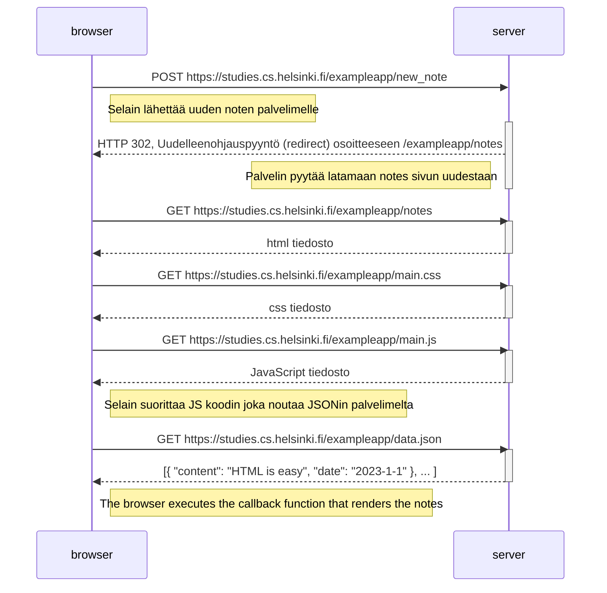
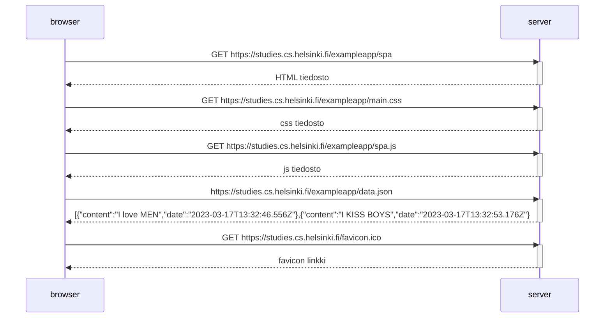

# osa0 - Web-sovelluksen toimintaperiaatteita

## 0.4: uusi muistiinpano



## 0.5: Single Page App



## 0.6: Uusi muistiinpano *(SAP)*

```mermaid
sequenceDiagram
    participant browser
    participant server
    
    browser->>server: POST https://studies.cs.helsinki.fi/exampleapp/new_note_spa
    Note right of browser: Selain lähettää uuden noten JSON muodossa
    activate server
    server-->> browser: Status 201, viesti note created   
    deactivate server
    
    
    Note left of server: Enempää HTTP pyyntöjä ei lähetetä
